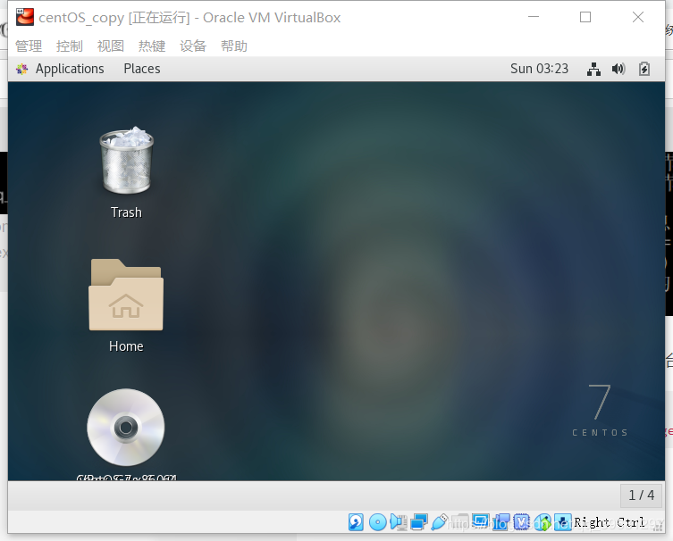

#### 17343009 陈建兵 作业一

## 实验目的
- 初步了解虚拟化技术，理解云计算的相关概念
- 理解系统工程师面临的困境
- 理解自动化安装、管理（DevOps）在云应用中的重要性
## 实验环境与要求
- 用户通过互联网，使用微软远程桌面，远程访问你在PC机上创建的虚拟机
- 虚拟机操作系统 Centos，Ubuntu，或 你喜欢的 Linux 发行版，能使用 NAT 访问外网
本人在进行实验时用了**Centos**操作系统
## 实验过程
#### 1. 安装 VirtualBox
到[Virtual Box官网](https://www.virtualbox.org/)下载VirtualBox即可，然后进行相关配置
创建虚拟机内部虚拟网络，使得 Vbox 内部虚拟机可以通过它，实现虚拟机之间、虚拟机与主机的通讯

#### 2. 创建Linux虚拟机
下载[CentOS Minimal](http://isoredirect.centos.org/centos/7/isos/x86_64/CentOS-7-x86_64-Minimal-1810.iso),创建虚拟机，使用该镜像文件（虚拟机名称建议以 centos-xxx 或 ub-xxx 命名）

将改虚拟机的第二个网卡启用，并设置为之前的适配器

根据老师的要求这里建完就要复制虚拟机(注意要**选择重新初始化所有网卡的 MAC 地址**，并且用**链接复制**)

系欸下来使用下列命令打开界面，修改主机名和第二块网卡IP地址
```
nmtui
```

本人将主机名设置成chenjb58，IP设置为192.168.100.1（注意：在VirtualBox全局设置中将网卡IP设置为192.168.100.1，这里的IP要设置成192.168.100.X的形式，否则可能ping 不通，图为安装好桌面后所截）

在windows主机的控制台ping一下该地址，成功连接：

接下来可以安装桌面，按照以下指令输入控制台即可，之后重启虚拟机
```
yum groupinstall "GNOME Desktop"
ln -sf /lib/systemd/system/runlevel5.target /etc/systemd/system/default.target
```

没有安装Virtual Box增强功能Guest Additions的虚拟机操作很不方便，比如：

- 虚拟机的分辨率最大只有1024x768；
- 鼠标被虚拟机捕获后要按右Ctrl键才能释放，否则只能再虚拟机里移动；
- 剪贴板不能共享如果还想安装VirtualBox增强功能Guest Additions

下载VBoxGuestAdditions文件，然后在虚拟机设置里添加该文件

然后找到VBOXADDITIONS_xxxxx文件，输入以下命令
```
sudo yum install -y kernel-devel gcc
cd /run/media/centos/VBOXADDITIONS_5.1.22_115126
sudo sh ./VBoxLinuxAdditions.run
```
这样就行了

#### 3. 远程桌面连接
要设置VirtualBox虚拟机远程访问模式
首先去[官网](https://www.virtualbox.org/wiki/Downloads)下载Oracle VM VirtualBox Extension Pack文件
在VirtualBox的全局设置的扩展里把这个文件添加进去

然后打开虚拟机的设置，修改“显示”里的配置，启用远程桌面服务器，修改服务器端口号

然后进行远程桌面连接（前面为适配器的IP，后面加虚拟机端口号）

点击连接


远程桌面连接就完成了（需要开启虚拟机）

# 结语
到了这里，搭建私有云的任务就基本完成了，之后是根据自己的开发需要在虚拟机上配置程序开发环境。
本次实验使我能了解云计算、云平台的一些基础构成，使我受益匪浅。