#### 17343009 

## windows下配置安装GO开发环境

- 下载安装
windows下十分方便，只要去[go语言中文网](https://studygolang.com/dl)下载windows版本的Go安装包安装即可。
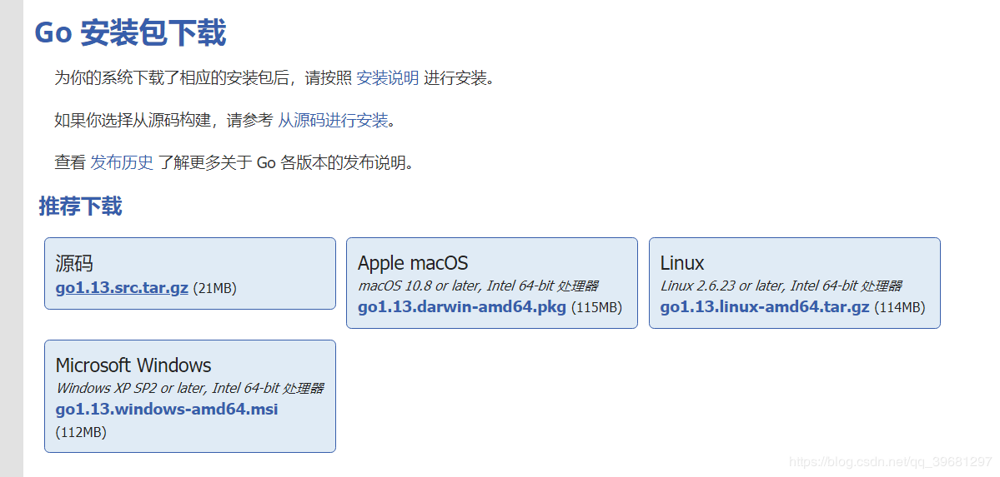
- 设置环境变量
将安装目录的bin文件夹路径复制到Path环境变量里
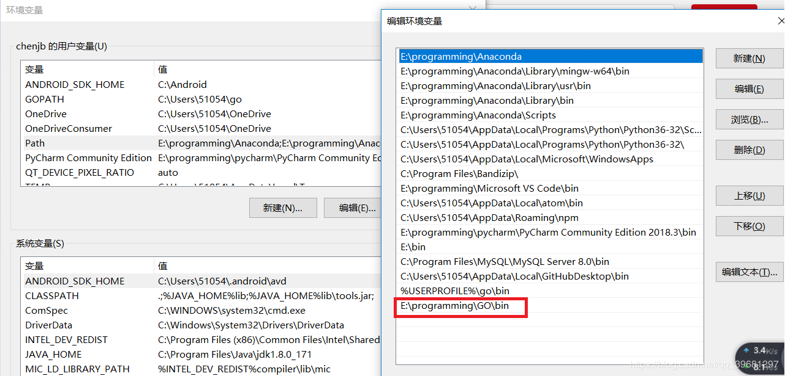
根据官方文档需要建立一个工作空间，将路径添加到GOPATH里，并创建三个文件夹
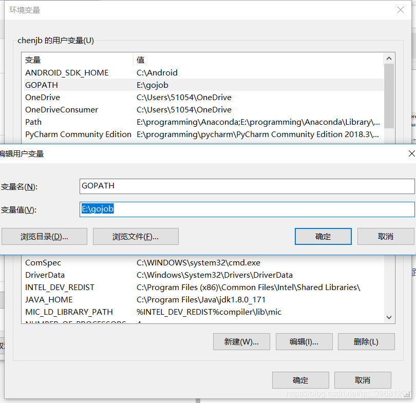

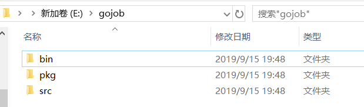
- src 目录包含 Go 的源文件
- pkg 目录包含包对象
- bin 目录包含可执行命令
详见[官方文档](https://go-zh.org/doc/code.html)

另外将GO安装目录添加到环境变量GOROOT
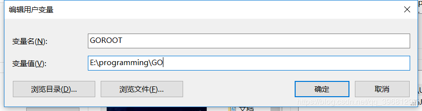
系统变量有的话要修改系统变量那里的变量值。


## 第一个Go程序

我直接打开工作空间(E:\gojob文件夹)
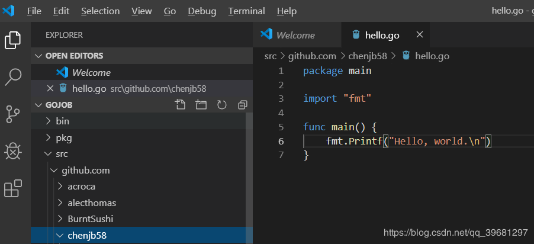
代码如下

```go
package main

import "fmt"

func main() {
	fmt.Printf("Hello, world.\n")
}
```
保存后在VSCode的控制台运行
- go run
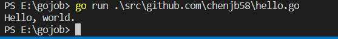
- go build
```go
go build .\src\github.com\chenjb58\hello.go
```
结果在当前路径下生成hello.exe文件
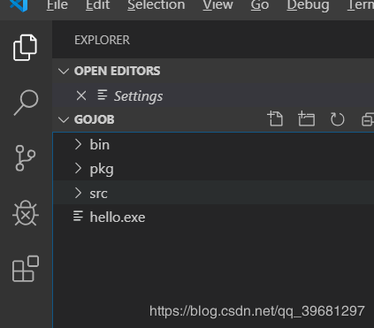

- go install
```go
go install hello.go
```
结果在bin文件夹下生成了hello.exe
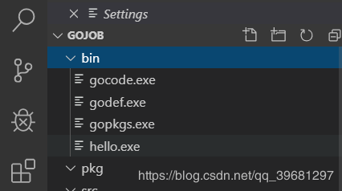

- 选择包路径（我们将使用 github.com/chenjb58/stringutil） 并创建包目录,在该目录中创建名为 reverse.go 的文件，内容如下：
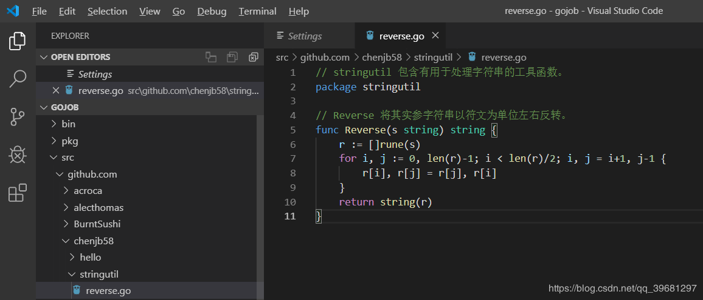
在这个目录下 go build（这不会产生输出文件）

- 修改原来的 hello.go 文件
```go
package main

import (
	"fmt"

	"github.com/chenjb58/stringutil"
)

func main() {
	fmt.Printf(stringutil.Reverse("!oG ,olleH"))
}
```
然后执行
```
go install .\src\github.com\chenjb58\hello
```
可以看到pkg文件夹多出了一些文件
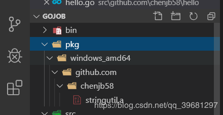
安装 hello 程序时，stringutil 包也会被自动安装。


## 测试
通过创建文件 $GOPATH/src/github.com/chenjb58/stringutil/reverse_test.go 来为 stringutil 添加测试，其内容如下：
```go
package stringutil

import "testing"

func TestReverse(t *testing.T) {
	cases := []struct {
		in, want string
	}{
		{"Hello, world", "dlrow ,olleH"},
		{"Hello, 世界", "界世 ,olleH"},
		{"", ""},
	}
	for _, c := range cases {
		got := Reverse(c.in)
		if got != c.want {
			t.Errorf("Reverse(%q) == %q, want %q", c.in, got, c.want)
		}
	}
}
```

接着使用 go test 运行该测试：
```
go test  src/github.com/chenjb58/stringutil
```
结果如下：
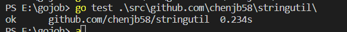


## 总结
官方文档给出的是linux的指令，我在windows用$GOPATH是错的，要用%GOPATH%才对，另外在vscode里两个都用不了这个我也不知道怎么回事。。。