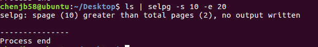

### Go Online传送门
[Go Online ](http://139.9.57.167:20080/share/bm93rpe76kvrcg19tdog?secret=false)

----


### 命令行程序是什么

CLI（Command Line Interface）实用程序是Linux下应用开发的基础。正确的编写命令行程序让应用与操作系统融为一体，通过shell或script使得应用获得最大的灵活性与开发效率。Linux提供了cat、ls、copy等命令与操作系统交互；go语言提供一组实用程序完成从编码、编译、库管理、产品发布全过程支持；容器服务如docker、k8s提供了大量实用程序支撑云服务的开发、部署、监控、访问等管理任务；git、npm等都是大家比较熟悉的工具。尽管操作系统与应用系统服务可视化、图形化，但在开发领域，CLI在编程、调试、运维、管理中提供了图形化程序不可替代的灵活性与效率。

----

### selpg的命令格式

- **-s**：startPage，后面接开始读取的页号
- **-e**：endPage，后面接结束读取的页号
- **-l**：后面跟行数，代表多少行分为一页
- **-f**：该标志无参数，代表按照分页符’\f’ 分页，一般默认72行为一页
- **-d**：“-dDestination”选项将选定的页直接发送至打印机，“Destination”应该是 lp 命令“-d”选项可接受的打印目的地名称
- **input_file，output_file 2，error_file**：输入文件、输出文件、错误信息文件的名字

----

### pflag的安装和使用

- **安装plag**

  ```go
  go get github.com/spf13/pflag
  ```

- **pflag的基本使用**

  - 定义flags

  ```go
  // 返回的是 指针
  var ip = flag.Int("flagname", 1234, "help message for flagname")
  ```

  - 将flag绑定到一个变量

  ```go
  var flagvar int
  
  func init() {
  	flag.IntVar(&flagvar, "flagname", 1234, "help message for flagname")
  }
  ```

  - 绑定自定义的类型

  ```go
  // 自定义类型需要实现value接口
  flag.Var(&flagVal, "name", "help message for flagname")
  ```

  - 解析

  ```go
  // 解析函数将会在碰到第一个非flag命令行参数时停止
  flag.Parse()
  ```

  - 添加shorthand参数

  ```go
  // func IntP(name, shorthand string, value int, usage string) *int
  // IntP is like Int, but accepts a shorthand letter that can be used after a single dash.
  var ip= flag.IntP("flagname", "f", 1234, "help message")
  ```

  - 设置非必须选项的默认值

  ```go
  var ip = flag.IntP("flagname", "f", 1234, "help message")
  flag.Lookup("flagname").NoOptDefVal = "4321"
  ```

----

### 其他包的使用

- **os**：参考博客[Go 标准库介绍三: os](https://blog.csdn.net/sanxiaxugang/article/details/61618911)或查看官方文档
- **io**:   参考博客[Go 标准库介绍五: io](https://blog.csdn.net/sanxiaxugang/article/details/65938952)或查看官方文档
- **bufio**： 参考博客[[Golang学习 - bufio 包](https://www.cnblogs.com/golove/p/3282667.html)](https://www.cnblogs.com/golove/p/3282667.html)或查看官方文档
- **os/exec**（简单用法）:  参考博客[golang exec 命令执行](https://www.jianshu.com/p/9787e30552ce)

### 代码设计

阅读源码[selpg.c](https://www.ibm.com/developerworks/cn/linux/shell/clutil/selpg.c), 根据类似的结构写

- 创建结构体表示命令行参数

  ```go
  type selpg_args struct{
  	spage int		//start page
  	epage int		//end page
  	plen int 		//page length
  	ptype int 		//page type, -f , default: -l
  	infile string 	//input file
  	printdest string //print destination
  }
  ```

- **main**函数

  ```go
  func main() {
  	selArgs := selpg_args{}
  	programName = os.Args[0]
  
  	initArgs(&selArgs)				//init the flag arguments, setting default values, and get arguments from the command line
  	handleArgs(len(os.Args), &selArgs) //handle the arguments
  	process(&selArgs)				//run the CLI command
  }
  ```

- 接下俩分为initArgs(&selpgArgs)、 handleArgs(len(os.Args), &selpgArgs)、process(&selArgs)三部分

  - **initArgs**(&selpgArgs) 初始化flag变量，并解析

    ```go
    func initArgs(args *selpg_args) {
    	pflag.Usage = func() {
    		fmt.Fprintf(os.Stderr,
    			"USAGE: \n%s -s start_page -e end_page [ -f | -l lines_per_page ]" + 
    			" [ -d dest ] [ in_filename ]\n", )
    		pflag.PrintDefaults()
    	}
    	pflag.IntVarP(&args.spage,"start", "s", 0, "start page")
    	pflag.IntVarP(&args.epage,"end","e", 0, "emd page")
    	//这里跟官方文档不同，使用10行作为默认值
    	pflag.IntVarP(&args.plen,"linenum", "l", 10, "page length (lines)")
    	pflag.BoolVarP(&args.ptype,"printdes","f", false, "'l' for lines-delimited, 'f' for form-feed-delimited. default is 'l'")
    	pflag.StringVarP(&args.printdest, "othertype","d", "", "print destination")
    	pflag.Parse() //解析
    }
    ```

  - **handleArgs**(argNum int, args *selpg_args) 处理参数

    ```go
    func handleArgs(argNum int, args *selpg_args) {
    	/* 检查参数合不合法 */
    	if argNum < 3 {
    		fmt.Fprintf(os.Stderr, "%s: not enough arguments\n", programName)
    		pflag.Usage()
    		os.Exit(1)
    	}
    
    	/* 第一个参数，spage*/
    	if os.Args[1][0] != '-' || os.Args[1][1] != 's' {
    		fmt.Fprintf(os.Stderr, "%s: 1st arg should be -s=spage\n", programName)
    		pflag.Usage()
    		os.Exit(2)
    	}
    	if args.spage < 1  {
    		fmt.Fprintf(os.Stderr, "%s: invalid start page %s\n", programName, args.spage)
    		pflag.Usage()
    		os.Exit(3)
    	}
    
    	/* 第二个参数，epage*/
    	if os.Args[3][0] != '-' || os.Args[3][1] != 'e' {
    		fmt.Fprintf(os.Stderr, "%s: 2nd arg should be -e=epage\n", programName)
    		pflag.Usage()
    		os.Exit(4)
    	}
    	if args.epage < 1  || args.epage < args.spage  {
    		fmt.Fprintf(os.Stderr, "%s: invalid end page %s\n", programName, args.epage)
    		pflag.Usage()
    		os.Exit(5)
    	}
        
    	/* 处理可选择的参数 */
    	if args.plen != 5 {
    		if args.plen < 1  {
    			fmt.Fprintf(os.Stderr, "%s: invalid page length %s\n", programName, args.plen)
    			pflag.Usage()
    			os.Exit(6)
    		}
    	}
    
    
    	/* 第三个参数，infile*/
    	if pflag.NArg() > 0 {
    		args.infile = pflag.Arg(0)
    		/*检查文件是否存在 */
    		file, err := os.Open(args.infile)
    		if err != nil {
    			fmt.Fprintf(os.Stderr, "%s: input file \"%s\" does not exist\n", programName, args.infile)
    			os.Exit(7)
    		}
    		/* 是否可读 */
    		file, err = os.OpenFile(args.infile, os.O_RDONLY, 0666)
    		if err != nil {
    			if os.IsPermission(err) {
    				fmt.Fprintf(os.Stderr, "%s: input file \"%s\" exists but cannot be read\n", programName, args.infile)
    				os.Exit(8)
    			}
    		}
    		file.Close()
    	}
    }
    
    ```

  - **handle**(args *selpg_args) 处理错误信息

    ```go
    func handle(args *selpg_args) {
    	//错误处理
    	if len(os.Args) < 3 {	/* Not enough args, minimum command is "selpg -sstartpage -eend_page"  */
    		fmt.Fprintf(os.Stderr, "\n%s: not enough arguments\n", programName)
    		pflag.Usage()
    		os.Exit(1)
    	}
    
    	/* handel -s */
    	if os.Args[1] != "-s" {
    		fmt.Fprintf(os.Stderr, "\n%s: 1st arg should be -s start_page\n", programName)
    		pflag.Usage()
    		os.Exit(2)
    	}
    	i := 1 << 32 - 1
    	if(args.spage < 1 || args.spage > i) {
    		fmt.Fprintf(os.Stderr, "\n%s: invalid start page %s\n", programName, os.Args[2])
    		pflag.Usage()
    		os.Exit(3)
    	}
    
    	/* handle -e*/
    	if os.Args[3] != "-e" {
    		fmt.Fprintf(os.Stderr, "\n%s: 2nd arg should be -e end_page\n", programName)
    		pflag.Usage()
    		os.Exit(4)
    	}
    	if args.epage < 1 || args.epage > i || args.epage < args.epage {
    		fmt.Fprintf(os.Stderr, "\n%s: invalid end page %i\n", programName, args.epage)
    		pflag.Usage()
    		os.Exit(5)
    	}
    	//
    	if len(pflag.Args()) == 1 {
    		_, err := os.Stat(pflag.Args()[0])
    		/* check if file exists */
    		if err != nil && os.IsNotExist(err) {
    			fmt.Fprintf(os.Stderr, "\n%s: input file \"%s\" does not exist\n",
    					programName, pflag.Args()[0]);
    			os.Exit(6);
    		}
    		args.infile = pflag.Args()[0]
    	}
    }
    ```

  - **process**(args *selpg_args) 运行结果

    ```go
    func process(args *selpg_args) {
    	fin := os.Stdin
    	fout := os.Stdout
    	var (
    		 pageCnt int
    		 lineCnt int
    		 err error
    		 err1 error
    		 err2 error
    		 line string
    		 cmd *exec.Cmd
    		 stdin io.WriteCloser
    	)
    	/* 处理fin输入 */
    	if args.infile != "" {
    		fin, err1 = os.Open(args.infile)
    		if err1 != nil {
    			fmt.Fprintf(os.Stderr, "%s: could not open input file \"%s\"\n", programName, args.infile)
    			os.Exit(11)
    		}
    	}
    
    	if args.printdest != "" {
    		//使用exec库的Command的函数调用，command返回cmd结构来执行带有相关参数的命令，它仅仅设定cmd结构中的Path和Args参数
    		cmd = exec.Command("cat", "-n")
    		//指定一个对象连接到对应的管道进行传输参数（stdinpipe）,获取输出（stdoutpipe）,获取错误（stderrpipe）
    		stdin, err = cmd.StdinPipe()
    		if err != nil {
    			fmt.Println(err)
    		}
    	} else {
    		stdin = nil
    	}
    
    /* 读取文件 */
    //NewReader 相当于 NewReaderSize(rd, 4096)
    	rd := bufio.NewReader(fin)
    	if args.ptype == false {
    		lineCnt = 0		//记录读了多少行
    		pageCnt = 1		//记录读了多少页
    		for true {
    			//用readString的方式读取，直到遇到换行符\n才停止读取
    			line, err2 = rd.ReadString('\n')
    			if err2 != nil { /* error or EOF */
    				break
    			}
    			lineCnt++
    			if lineCnt > args.plen { 	//到达设定的每页最大行数
    				pageCnt++
    				lineCnt = 1
    			}
    			if pageCnt >= args.spage && pageCnt <= args.epage {
    				fmt.Fprintf(fout, "%s", line)
    			}
    		}
    	} else {
    		pageCnt = 1
    		for true {
    			//用ReadByte的方式读取
    			c, err3 := rd.ReadByte()
    			if err3 != nil { /* error or EOF */
    				break
    			}
    			if c == '\f' { //以换页符为标志记录读过的页数
    				pageCnt++
    			}
    			if pageCnt >= args.spage && pageCnt <= args.epage {
    				fmt.Fprintf(fout, "%c", c)
    			}
    		}
    		fmt.Print("\n")
    	}
    
    	/* 循环后的处理*/
    	// pageCnt比开始页面还小，说明出错了
    	if pageCnt < args.spage {
    		fmt.Fprintf(os.Stderr, "%s: spage (%d) greater than total pages (%d), no output written\n", programName, args.spage, pageCnt)
    	} else if pageCnt < args.epage { //pageCnt比结束页面小，同样也是出错
    		fmt.Fprintf(os.Stderr, "%s: epage (%d) greater than total pages (%d), less output than expected\n", programName, args.epage, pageCnt)
    	}
    	
    	//输出文件名不为空
    	if args.printdest != "" {
    		stdin.Close()
    		cmd.Stdout = fout
    		cmd.Run()
    	}
    	fmt.Fprintf(os.Stderr,"\n---------------\nProcess end\n")
    	fin.Close()
    	fout.Close()
    }
    ```

  ----

###测试结果

测试文件名称为 **in**

内容为999行数字(1-999)， 每一行的数字表示行数

- **selpg -s1 -e1 input_file**

  

- **selpg -s1 -e1 < input_file**

  

- **other_command | selpg -s10 -e20**

  

  这个是因为文件没有那么多页造成的，实际上文件只有一页(没有换页符\f)， 换一下参数就行了

  

- **selpg -s1 -e2 input_file >output_file**

  

  控制台并没有输出，输出的信息保存在out文件中

- **selpg -s1 -e2 input_file 2>error_file**

  

  这是因为我的参数后面直接加数字没有隔开空格造成的erro，可能是因为我是ubuntu16.04的原因。

  

  这样就正常了

- **selpg -s10 -e20 input_file >output_file 2>error_file**

  

  将正确的信息输出到out文件，错误信息输出到error文件

- **selpg -s10 -e20 input_file >output_file 2>/dev/null**

  

  标准输出被重定向至“out”；selpg 写至标准错误的所有内容都被重定向至 /dev/null（空设备），这意味着错误消息被丢弃了。

- **selpg -s10 -e20 input_file >/dev/null**

  

  标准输出被丢弃；错误消息在屏幕出现。

- 其他的测试就不多做介绍了

----

### 总结

本次实验要求去阅读源码并将其用Go语言形式表达出来，开发一个简单的selpg命令行指令。其中有一些东西没有提示需要自己去查，比如怎么直接在终端使用selpg指令而不是在IDE里运行，需要设置环境变量。先将selpg.go程序go build，再go install到全局变量文件夹(也可以手动复制到全局变量的文件夹里)，之后就可以像我上面那样测试了。

本次实验使我学习了更多的包和函数知识，锻炼了go语言的编程能力。