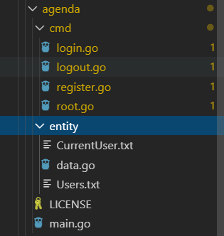
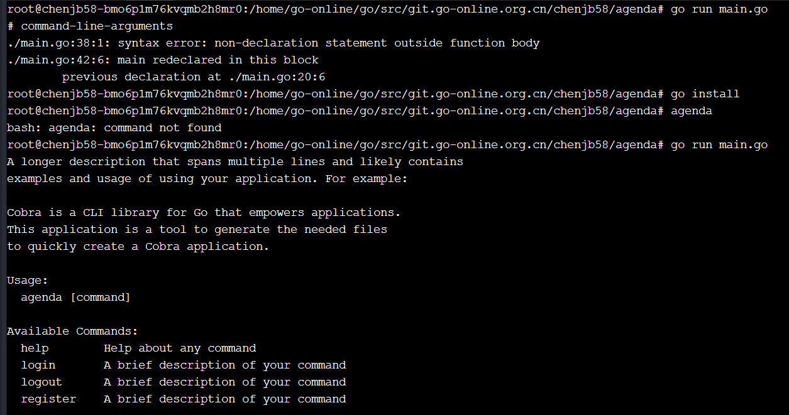
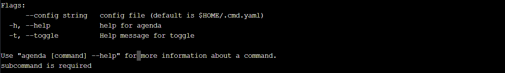
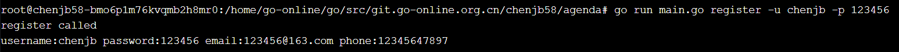
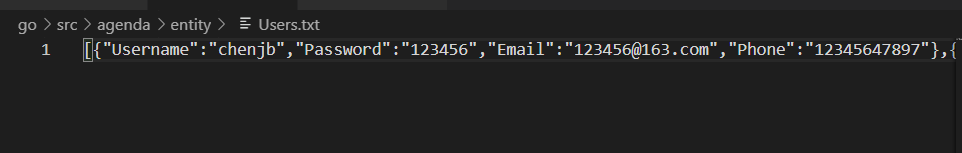
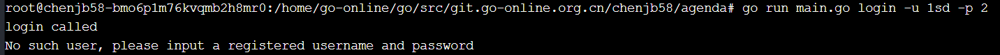
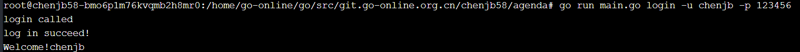
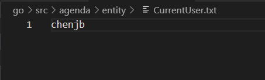
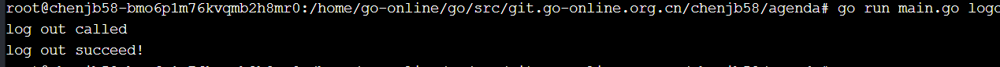
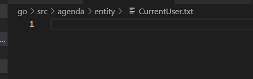

### 服务计算：CLI 命令行实用程序开发实战 - Agenda

#### 1、概述

命令行实用程序并不是都象 cat、more、grep 是简单命令。[go](https://go-zh.org/cmd/go/) 项目管理程序，类似 java 项目管理 [maven](http://maven.apache.org/)、Nodejs 项目管理程序 [npm](https://www.npmjs.com/)、git 命令行客户端、 docker 与 kubernetes 容器管理工具等等都是采用了较复杂的命令行。即一个实用程序同时支持多个子命令，每个子命令有各自独立的参数，命令之间可能存在共享的代码或逻辑，同时随着产品的发展，这些命令可能发生功能变化、添加新命令等。因此，符合 [OCP 原则](https://en.wikipedia.org/wiki/Open/closed_principle) 的设计是至关重要的编程需求。

**任务目标**

1. 熟悉 go 命令行工具管理项目
2. 综合使用 go 的函数、数据结构与接口，编写一个简单命令行应用 agenda
3. 使用面向对象的思想设计程序，使得程序具有良好的结构命令，并能方便修改、扩展新的命令,不会影响其他命令的代码
4. 项目部署在 Github 上，合适多人协作，特别是代码归并
5. 支持日志（原则上不使用debug调试程序）

 #### 2、GO命令

[GO命令](https://go-zh.org/cmd/go/) 的官方说明并不一定是最新版本。最新说明请使用命令 `go help` 获取。 [关于GO命令](https://go-zh.org/doc/articles/go_command.html)

必须了解的环境变量：**GOROOT，GOPATH**
[项目目录与 gopath](https://go-zh.org/cmd/go/#hdr-GOPATH_environment_variable)

##### 2.1 go 命令的格式

使用：

```
go command [arguments]
```

版本（go 1.8）的命令有：

```
build       compile packages and dependencies
clean       remove object files
doc         show documentation for package or symbol
env         print Go environment information
bug         start a bug report
fix         run go tool fix on packages
fmt         run gofmt on package sources
generate    generate Go files by processing source
get         download and install packages and dependencies
install     compile and install packages and dependencies
list        list packages
run         compile and run Go program
test        test packages
tool        run specified go tool
version     print Go version
vet         run go tool vet on packages
```

##### 2.2 go 命令分类

1. 环境显示： version、env
2. 构建流水线： clean、build、test、run、（publish/git）、get、install
3. 包管理： list, get, install
4. 杂项：fmt，vet，doc，tools …

具体命令格式与参数使用 `go help [topic]`

#### 3、准备知识或资源

### 3.1 Golang 知识整理

这里推荐 time-track 的个人博客，它的学习轨迹与课程要求基本一致。以下是他语言学习的笔记，可用于语言快速浏览与参考：

- [《Go程序设计语言》要点总结——程序结构](http://time-track.cn/gopl-notes-program-structure.html)
- [《Go程序设计语言》要点总结——数据类型](http://time-track.cn/gopl-notes-types.html)
- [《Go程序设计语言》要点总结——函数](http://time-track.cn/gopl-notes-function.html)
- [《Go程序设计语言》要点总结——方法](http://time-track.cn/gopl-notes-function.html)
- [《Go程序设计语言》要点总结——接口](http://time-track.cn/gopl-notes-interface.html)

以上仅代表作者观点，部分内容是不准确的，请用批判的态度看待网上博客。 切记：

- GO **不是面向对象(OOP)** 的。 所谓方法只是一种[语法糖](https://baike.baidu.com/item/语法糖)，它是特定类型上定义的操作（operation）
- 指针是没有 nil 的，这可以避免一些尴尬。 `p.X` 与 `v.x` (p 指针， v 值) 在语义上是无区别的，但实现上是有区别的 `p.x` 是实现 c 语言 `p->x` 的语法糖
- zero 值好重要

### 3.2 JSON 序列化与反序列化

参考：[JSON and Go](https://blog.go-zh.org/json-and-go)
json 包是内置支持的，文档位置：https://go-zh.org/pkg/encoding/json/

### 3.3 复杂命令行的处理

不要轻易“发明轮子”。为了实现 POSIX/GNU-风格参数处理，–flags，包括命令完成等支持，程序员们开发了无数第三方包，这些包可以在 [godoc](https://godoc.org/) 找到。

- pflag 包： https://godoc.org/github.com/spf13/pflag
- cobra 包： https://godoc.org/github.com/spf13/cobra
- goptions 包： https://godoc.org/github.com/voxelbrain/goptions
- …
- docker command 包：https://godoc.org/github.com/docker/cli/cli/command

[go dead project](http://www.xuebuyuan.com/1588520.html) **非常有用**

这里我们选择 cobar 这个工具。

**tip: 安装 cobra**

- 使用命令 `go get -v github.com/spf13/cobra/cobra` 下载过程中，会出提示如下错误

```
Fetching https://golang.org/x/sys/unix?go-get=1
https fetch failed: Get https://golang.org/x/sys/unix?go-get=1: dial tcp 216.239.37.1:443: i/o timeout
```

这是熟悉的错误，请在 `$GOPATH/src/golang.org/x` 目录下用 `git clone` 下载 `sys` 和 `text` 项目，然后使用 `go install github.com/spf13/cobra/cobra`, 安装后在 `$GOBIN` 下出现了 cobra 可执行程序。

**Cobra 的简单使用**

创建一个处理命令 `agenda register -uTestUser `或 `agenda register --user=TestUser` 的小程序。

简要步骤如下：

```
cobra init
cobra add register
```

需要的文件就产生了。 你需要阅读 `main.go` 的 `main()` ; `root.go` 的 `Execute()`; 最后修改 `register.go`, `init()` 添加：

```
registerCmd.Flags().StringP("user", "u", "Anonymous", "Help message for username")
```

`Run` 匿名回调函数中添加：

```
username, _ := cmd.Flags().GetString("user")
fmt.Println("register called by " + username)
```

测试命令：

```
$ go run main.go register --user=TestUser
register called by TestUser
```

参考文档：

- [官方文档](https://github.com/spf13/cobra#overview) **推荐**
- [golang命令行库cobra的使用](https://www.cnblogs.com/borey/p/5715641.html) 中文翻译

#### 4、agenda 开发项目

##### 4.1 需求描述

- 业务需求：见后面附件
- 功能需求： 设计一组命令完成 agenda 的管理，例如：
  - agenda help ：列出命令说明
  - agenda register -uUserName –password pass –email=a@xxx.com ：注册用户
  - agenda help register ：列出 register 命令的描述
  - agenda cm … : 创建一个会议
  - 原则上一个命令对应一个业务功能
- 持久化要求：
  - 使用 json 存储 User 和 Meeting 实体
  - 当前用户信息存储在 CurrentUserName.txt 中
- 项目目录
  - cmd ：存放命令实现代码
  - entity ：存放 User 和 Meeting 对象读写与处理逻辑
  - 其他目录 ： 自由添加

##### 4.2 实现

由于潘老师降低了要求，只要求能实现两个指令就可以了。

我实现了一下三个指令：

- 注册用户 register
- 登录 login
- 登出 logout

##### （一）总体架构

​	正如程序结构所示：



##### （二）实现逻辑

- cmd文件夹

  里面的go程序(除了root.go)都是根命令的子命令,定义了命令的逻辑和参数

  拿login.go举例

  ```go
  /*
  Copyright © 2019 NAME HERE <EMAIL ADDRESS>
  
  Licensed under the Apache License, Version 2.0 (the "License");
  you may not use this file except in compliance with the License.
  You may obtain a copy of the License at
  
      http://www.apache.org/licenses/LICENSE-2.0
  
  Unless required by applicable law or agreed to in writing, software
  distributed under the License is distributed on an "AS IS" BASIS,
  WITHOUT WARRANTIES OR CONDITIONS OF ANY KIND, either express or implied.
  See the License for the specific language governing permissions and
  limitations under the License.
  */
  package cmd
  
  import (
  	"fmt"
  	"agenda/entity"
  	"github.com/spf13/cobra"
  )
  
  // loginCmd represents the login command
  var loginCmd = &cobra.Command{
  	Use:   "login",
  	Short: "A brief description of your command",
  	Long: `A longer description that spans multiple lines and likely contains examples
  and usage of using your command. For example:
  
  Cobra is a CLI library for Go that empowers applications.
  This application is a tool to generate the needed files
  to quickly create a Cobra application.`,
  	Run: func(cmd *cobra.Command, args []string) {
  		fmt.Println("login called")
  		_username,_ := cmd.Flags().GetString("user")
  		_password,_ := cmd.Flags().GetString("password")
  		users := entity.ReadUsers()
  		for _,user := range(users) {
  			if _username == user.Username && _password == user.Password {//匹配
  				entity.SetCurrentUserName(_username)
  				fmt.Println("log in succeed!")
  				fmt.Println("Welcome!"+_username)
  				return 
  			} else if _username == user.Username && _password != user.Password {
  				fmt.Println("Wrong Password!")
  				return
  			}
  		}
  		fmt.Println("No such user, please input a registered username and password")
  		return
  	},
  }
  
  func init() {
  	loginCmd.Flags().StringP("user","u","","log in")
  	loginCmd.Flags().StringP("password","p","","log in")
  	rootCmd.AddCommand(loginCmd)
  
  	// Here you will define your flags and configuration settings.
  
  	// Cobra supports Persistent Flags which will work for this command
  	// and all subcommands, e.g.:
  	// loginCmd.PersistentFlags().String("foo", "", "A help for foo")
  
  	// Cobra supports local flags which will only run when this command
  	// is called directly, e.g.:
  	// loginCmd.Flags().BoolP("toggle", "t", false, "Help message for toggle")
  }
  
  ```

  用cobra进行初始化之后主要修改loginCmd的Run方法以及init方法实现登录的逻辑。

- entity文件夹

  负责与数据库的交互以及存储数据

  CurrentUser.txt存储了登录了的用户的Username

  Users.txt存储了已经注册的所有用户的信息(json格式)

  data.go负责交互的方法

  ```go
  package entity
  
  import (
  	"encoding/json"
  	"fmt"
  	"io/ioutil"
  	"os"
  )
  
  type User struct{
  	Username	string
  	Password	string
  	Email		string
  	Phone 		string
  }
  
  func checkerr(err error){
  	if err != nil {
  		fmt.Println(err)
  	}
  }
  
  func GetCurrentUserName()(username string){
  	dir,err := os.Getwd()
  	checkerr(err)
  	b,err := ioutil.ReadFile(dir+"/entity/currentUser.txt")
  	checkerr(err)
  	username = string(b)
  	return username
  }
  
  func SetCurrentUserName(username string){
  	dir,err := os.Getwd()
  	checkerr(err)
  	b := []byte(username)
  	err = ioutil.WriteFile(dir+"/entity/currentUser.txt",b,0777)
  	checkerr(err)
  }
  
  func ReadUsers()(user []User){
  	dir,err := os.Getwd()
  	checkerr(err)
  	b,err := ioutil.ReadFile(dir+"/entity/Users.txt")
  	var users []User
  	json.Unmarshal(b,&users)
  	return users
  }
  
  func WriteUsers(users []User){
  	dir,err := os.Getwd()
  	checkerr(err)
  	data,err := json.Marshal(users)
  	checkerr(err)
  	b := []byte(data)
  	err = ioutil.WriteFile(dir+"/entity/Users.txt",b,0777)
  	checkerr(err)
  }
  ```

#### （三）测试

- 查看命令的基本信息`go run main.go `





- 注册用户 `go run main.go register -u xxx -p xxx -e xxx -t xxx `

  参数都是可选类型的



​		注册完Users.txt会更新



- 登录 `go run main.go login -u xxx -p xxx`

  如果Users.txt里面没有用户信息则会报错



​		需要输入正确的用户名和密码



​		登陆完会发现CurrentUser.txt出现了该用户的名字。

​		

- 登出`go run main.go logout`

  成功登出



​		这时CurrentUser.txt会清空

#### 5、全部代码

- login.go

  ```go
  /*
  Copyright © 2019 NAME HERE <EMAIL ADDRESS>
  
  Licensed under the Apache License, Version 2.0 (the "License");
  you may not use this file except in compliance with the License.
  You may obtain a copy of the License at
  
      http://www.apache.org/licenses/LICENSE-2.0
  
  Unless required by applicable law or agreed to in writing, software
  distributed under the License is distributed on an "AS IS" BASIS,
  WITHOUT WARRANTIES OR CONDITIONS OF ANY KIND, either express or implied.
  See the License for the specific language governing permissions and
  limitations under the License.
  */
  package cmd
  
  import (
  	"fmt"
  	"agenda/entity"
  	"github.com/spf13/cobra"
  )
  
  // loginCmd represents the login command
  var loginCmd = &cobra.Command{
  	Use:   "login",
  	Short: "A brief description of your command",
  	Long: `A longer description that spans multiple lines and likely contains examples
  and usage of using your command. For example:
  
  Cobra is a CLI library for Go that empowers applications.
  This application is a tool to generate the needed files
  to quickly create a Cobra application.`,
  	Run: func(cmd *cobra.Command, args []string) {
  		fmt.Println("login called")
  		_username,_ := cmd.Flags().GetString("user")
  		_password,_ := cmd.Flags().GetString("password")
  		users := entity.ReadUsers()
  		for _,user := range(users) {
  			if _username == user.Username && _password == user.Password {//匹配
  				entity.SetCurrentUserName(_username)
  				fmt.Println("log in succeed!")
  				fmt.Println("Welcome!"+_username)
  				return 
  			} else if _username == user.Username && _password != user.Password {
  				fmt.Println("Wrong Password!")
  				return
  			}
  		}
  		fmt.Println("No such user, please input a registered username and password")
  		return
  	},
  }
  
  func init() {
  	loginCmd.Flags().StringP("user","u","","log in")
  	loginCmd.Flags().StringP("password","p","","log in")
  	rootCmd.AddCommand(loginCmd)
  
  	// Here you will define your flags and configuration settings.
  
  	// Cobra supports Persistent Flags which will work for this command
  	// and all subcommands, e.g.:
  	// loginCmd.PersistentFlags().String("foo", "", "A help for foo")
  
  	// Cobra supports local flags which will only run when this command
  	// is called directly, e.g.:
  	// loginCmd.Flags().BoolP("toggle", "t", false, "Help message for toggle")
  }
  
  ```

-  logout.go

  ```go
  /*
  Copyright © 2019 NAME HERE <EMAIL ADDRESS>
  
  Licensed under the Apache License, Version 2.0 (the "License");
  you may not use this file except in compliance with the License.
  You may obtain a copy of the License at
  
      http://www.apache.org/licenses/LICENSE-2.0
  
  Unless required by applicable law or agreed to in writing, software
  distributed under the License is distributed on an "AS IS" BASIS,
  WITHOUT WARRANTIES OR CONDITIONS OF ANY KIND, either express or implied.
  See the License for the specific language governing permissions and
  limitations under the License.
  */
  package cmd
  
  import (
  	"fmt"
  	"agenda/entity"
  	"github.com/spf13/cobra"
  )
  
  // logoutCmd represents the logout command
  var logoutCmd = &cobra.Command{
  	Use:   "logout",
  	Short: "A brief description of your command",
  	Long: `A longer description that spans multiple lines and likely contains examples
  and usage of using your command. For example:
  
  Cobra is a CLI library for Go that empowers applications.
  This application is a tool to generate the needed files
  to quickly create a Cobra application.`,
  	Run: func(cmd *cobra.Command, args []string) {
  		fmt.Println("log out called")
  		entity.SetCurrentUserName("")
  		fmt.Println("log out succeed!")
  	},
  }
  
  func init() {
  	rootCmd.AddCommand(logoutCmd)
  
  	// Here you will define your flags and configuration settings.
  
  	// Cobra supports Persistent Flags which will work for this command
  	// and all subcommands, e.g.:
  	// logoutCmd.PersistentFlags().String("foo", "", "A help for foo")
  
  	// Cobra supports local flags which will only run when this command
  	// is called directly, e.g.:
  	// logoutCmd.Flags().BoolP("toggle", "t", false, "Help message for toggle")
  }
  
  ```

- register.go 

  ```go
  /*
  Copyright © 2019 NAME HERE <EMAIL ADDRESS>
  
  Licensed under the Apache License, Version 2.0 (the "License");
  you may not use this file except in compliance with the License.
  You may obtain a copy of the License at
  
      http://www.apache.org/licenses/LICENSE-2.0
  
  Unless required by applicable law or agreed to in writing, software
  distributed under the License is distributed on an "AS IS" BASIS,
  WITHOUT WARRANTIES OR CONDITIONS OF ANY KIND, either express or implied.
  See the License for the specific language governing permissions and
  limitations under the License.
  */
  package cmd
  
  import (
  	"fmt"
  	"agenda/entity"
  	"github.com/spf13/cobra"
  )
  
  // registerCmd represents the register command
  var registerCmd = &cobra.Command{
  	Use:   "register",
  	Short: "A brief description of your command",
  	Long: `A longer description that spans multiple lines and likely contains examples
  and usage of using your command. For example:
  
  Cobra is a CLI library for Go that empowers applications.
  This application is a tool to generate the needed files
  to quickly create a Cobra application.`,
  	Run: func(cmd *cobra.Command, args []string) {
  		fmt.Println("register called")
  		_username,_ := cmd.Flags().GetString("user")
  		_password,_ := cmd.Flags().GetString("password")
  		_email,_ := cmd.Flags().GetString("email")
  		_phone,_ := cmd.Flags().GetString("phone")
  		fmt.Println("username:"+_username+" password:"+_password+" email:"+_email+" phone:"+_phone)
  		if _username == "default user" {
  			fmt.Println("username can not be empty")
  			return 
  		}
  		users := entity.ReadUsers()
  		for i := 0; i < len(users); i++ {
  			if users[i].Username == _username {
  				fmt.Println("this username has been registered")
  				return
  			}
  		}
  		newUser := entity.User{_username,_password,_email,_phone}
  		users = append(users,newUser)
  		entity.WriteUsers(users)
  	},
  }
  
  func init() {
  	registerCmd.Flags().StringP("user","u","default user","Help message for username")
  	registerCmd.Flags().StringP("password","p","123456","password of user")
  	registerCmd.Flags().StringP("email","e","123456@163.com","email of user")
  	registerCmd.Flags().StringP("phone","t","12345647897","phone number of user")//telephone
  	rootCmd.AddCommand(registerCmd)
  
  	// Here you will define your flags and configuration settings.
  
  	// Cobra supports Persistent Flags which will work for this command
  	// and all subcommands, e.g.:
  	// registerCmd.PersistentFlags().String("foo", "", "A help for foo")
  
  	// Cobra supports local flags which will only run when this command
  	// is called directly, e.g.:
  	// registerCmd.Flags().BoolP("toggle", "t", false, "Help message for toggle")
  }
  
  ```

  

- root.go 

  ```go
  /*
  Copyright © 2019 NAME HERE <EMAIL ADDRESS>
  
  Licensed under the Apache License, Version 2.0 (the "License");
  you may not use this file except in compliance with the License.
  You may obtain a copy of the License at
  
      http://www.apache.org/licenses/LICENSE-2.0
  
  Unless required by applicable law or agreed to in writing, software
  distributed under the License is distributed on an "AS IS" BASIS,
  WITHOUT WARRANTIES OR CONDITIONS OF ANY KIND, either express or implied.
  See the License for the specific language governing permissions and
  limitations under the License.
  */
  package cmd
  
  import (
    "fmt"
    "os"
    "github.com/spf13/cobra"
  
    homedir "github.com/mitchellh/go-homedir"
    "github.com/spf13/viper"
  
  )
  
  
  var cfgFile string
  
  
  // rootCmd represents the base command when called without any subcommands
  var rootCmd = &cobra.Command{
    Use:   "agenda",
    Short: "A brief description of your application",
    Long: `A longer description that spans multiple lines and likely contains
  examples and usage of using your application. For example:
  
  Cobra is a CLI library for Go that empowers applications.
  This application is a tool to generate the needed files
  to quickly create a Cobra application.`,
    // Uncomment the following line if your bare application
    // has an action associated with it:
    //	Run: func(cmd *cobra.Command, args []string) { },
  }
  
  // Execute adds all child commands to the root command and sets flags appropriately.
  // This is called by main.main(). It only needs to happen once to the rootCmd.
  func Execute() {
    if err := rootCmd.Execute(); err != nil {
      fmt.Println(err)
      os.Exit(1)
    }
  }
  
  func init() {
    cobra.OnInitialize(initConfig)
  
    // Here you will define your flags and configuration settings.
    // Cobra supports persistent flags, which, if defined here,
    // will be global for your application.
  
    rootCmd.PersistentFlags().StringVar(&cfgFile, "config", "", "config file (default is $HOME/.cmd.yaml)")
  
  
    // Cobra also supports local flags, which will only run
    // when this action is called directly.
    rootCmd.Flags().BoolP("toggle", "t", false, "Help message for toggle")
  }
  
  
  // initConfig reads in config file and ENV variables if set.
  func initConfig() {
    if cfgFile != "" {
      // Use config file from the flag.
      viper.SetConfigFile(cfgFile)
    } else {
      // Find home directory.
      home, err := homedir.Dir()
      if err != nil {
        fmt.Println(err)
        os.Exit(1)
      }
  
      // Search config in home directory with name ".cmd" (without extension).
      viper.AddConfigPath(home)
      viper.SetConfigName(".agenda")
    }
  
    viper.AutomaticEnv() // read in environment variables that match
  
    // If a config file is found, read it in.
    if err := viper.ReadInConfig(); err == nil {
      fmt.Println("Using config file:", viper.ConfigFileUsed())
    }
  }
  
  
  ```

  

-  data.go

  ```go
  package entity
  
  import (
  	"encoding/json"
  	"fmt"
  	"io/ioutil"
  	"os"
  )
  
  type User struct{
  	Username	string
  	Password	string
  	Email		string
  	Phone 		string
  }
  
  func checkerr(err error){
  	if err != nil {
  		fmt.Println(err)
  	}
  }
  
  func GetCurrentUserName()(username string){
  	dir,err := os.Getwd()
  	checkerr(err)
  	b,err := ioutil.ReadFile(dir+"/entity/currentUser.txt")
  	checkerr(err)
  	username = string(b)
  	return username
  }
  
  func SetCurrentUserName(username string){
  	dir,err := os.Getwd()
  	checkerr(err)
  	b := []byte(username)
  	err = ioutil.WriteFile(dir+"/entity/currentUser.txt",b,0777)
  	checkerr(err)
  }
  
  func ReadUsers()(user []User){
  	dir,err := os.Getwd()
  	checkerr(err)
  	b,err := ioutil.ReadFile(dir+"/entity/Users.txt")
  	var users []User
  	json.Unmarshal(b,&users)
  	return users
  }
  
  func WriteUsers(users []User){
  	dir,err := os.Getwd()
  	checkerr(err)
  	data,err := json.Marshal(users)
  	checkerr(err)
  	b := []byte(data)
  	err = ioutil.WriteFile(dir+"/entity/Users.txt",b,0777)
  	checkerr(err)
  }
  ```

  

- main.go

  ```go
  /*
  Copyright © 2019 NAME HERE <EMAIL ADDRESS>
  
  Licensed under the Apache License, Version 2.0 (the "License");
  you may not use this file except in compliance with the License.
  You may obtain a copy of the License at
  
      http://www.apache.org/licenses/LICENSE-2.0
  
  Unless required by applicable law or agreed to in writing, software
  distributed under the License is distributed on an "AS IS" BASIS,
  WITHOUT WARRANTIES OR CONDITIONS OF ANY KIND, either express or implied.
  See the License for the specific language governing permissions and
  limitations under the License.
  */
  package main
  
  import "agenda/cmd"
  
  func main() {
    cmd.Execute()
  }
  
  ```

  

